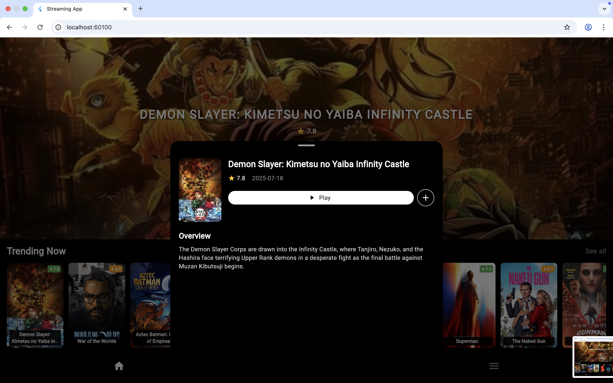

# 🎬 VE Movies App

A Flutter application that demonstrates clean architecture with **Dependency Injection (GetIt)**, **BLoC state management**, and environment configuration via **dotenv / dart-define**.  

---

## 📂 Project Structure
- **lib/app/domain** → Business logic (entities, repositories, use cases)  
- **lib/app/infra** → Data layer (API implementations, repositories)  
- **lib/app/presentation** → UI layer (views, widgets, blocs)  
- **lib/app/core/di** → Service locator setup (`GetIt`)  

---

## 🔧 Key Features
- **BLoC (flutter_bloc)** for state management  
- **GetIt** for dependency injection (service locator pattern)  
- **flutter_dotenv** for environment variables on mobile/desktop  
- **--dart-define** for secure config on web builds  
- Clean separation of concerns (API → Repository → UseCase → Bloc → UI)  

---

## 🚀 How to Run

### 1. Install dependencies
flutter pub get
### 2. Set environment variables
Mobile/Desktop → create assets/env/.env:
API_BASE_URL=https://api.example.com
API_TOKEN=your_bearer_token
### 3. Run
flutter run

## 🛠 Notes

Keep .env out of version control.

But on this project, I push .env to repo so you can easily run the app. :) 

Here are some screenshot of the apps: 

## Mobile: 

  
  
  
  
  
  

## Web:

  
  
  
  

Thank you!!!

